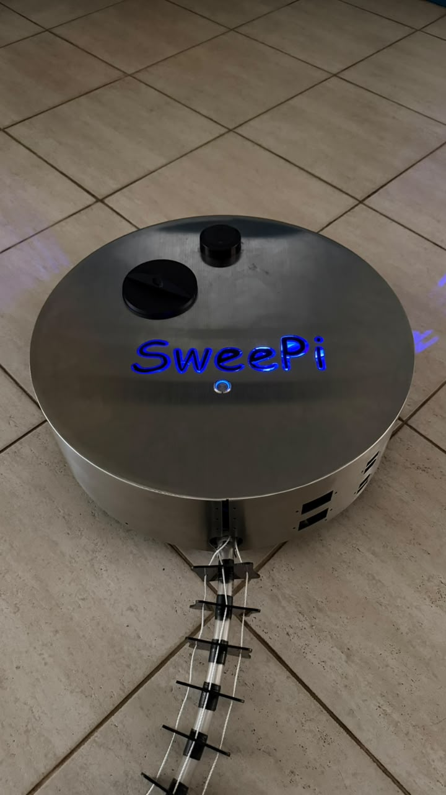
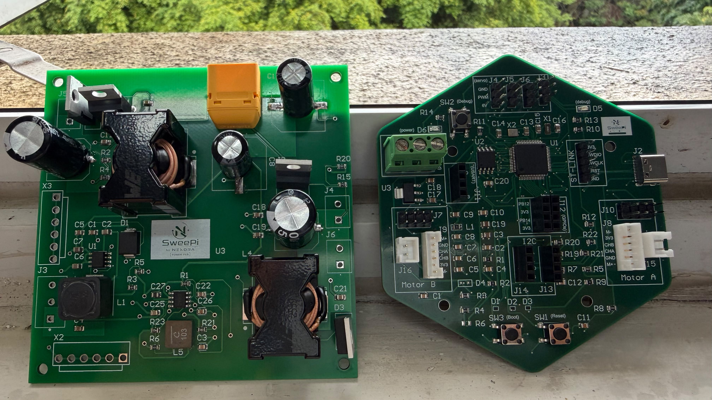
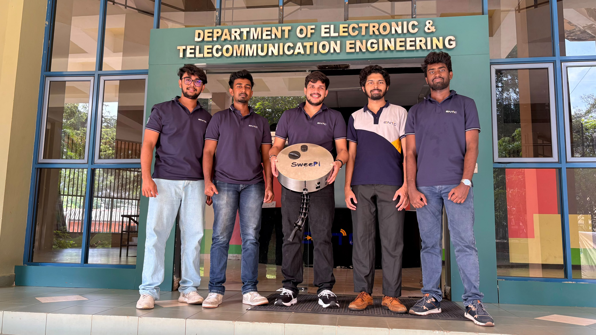

# 🤖 SweePi — Autonomous Floor Cleaning Robot

### Intelligent ROS 2 Powered Indoor Cleaning Robot with Smart Coverage Navigation

<p align="center">
  
</p>

<p align="center">
  <b>LiDAR SLAM • ROS 2 Jazzy • Nav2 • Raspberry Pi 5 • STM32 • Autonomous Coverage Cleaning</b>
</p>

<p align="center">
  
  
  
  
  
</p>

---

## 📖 Overview

**SweePi** is an autonomous indoor floor cleaning robot developed as an **Engineering Design Realization Project** by **Team Nexora**.

Unlike conventional robotic vacuum cleaners that rely on random navigation, SweePi utilizes **LiDAR-based Simultaneous Localization and Mapping (SLAM)** together with the **ROS 2 Navigation Stack (Nav2)** to generate maps, localize itself, plan optimal paths, and systematically clean the environment.

The robot features a custom-designed hardware platform powered by a **Raspberry Pi 5** and an **STM32G474RET6** real-time controller, enabling precise motion control, sensor fusion, intelligent coverage planning, and seamless mobile application integration.

---

# ✨ Features

- 🗺️ LiDAR-based SLAM Mapping
- 📍 Autonomous Localization
- 🚗 ROS 2 Navigation (Nav2)
- 🧹 Intelligent Coverage Path Planning
- 📊 Live Cleaning Progress Tracking
- 📱 Flutter Mobile Application
- 🌐 REST API Communication
- ⚙️ STM32 Real-Time Motor Controller
- 🔋 Dual Battery Architecture
- 📶 Wi-Fi Connectivity
- 🚧 Intelligent Obstacle Avoidance
- 📦 Modular ROS 2 Package Architecture
- 📈 Real-Time Coverage Monitoring
- 🔄 Simulation & Real Robot Support

---

# 🎥 Demonstration

<!-- <p align="center">

https://github.com/user-attachments/assets/YOUR_VIDEO_ID

</p> -->

Alternatively, download the original demonstration video:

📹 **[Final Demonstration Video](Media/final_video.mp4)**

---

# 🏗 System Architecture

```text
                            Mobile Application
                                    │
                              REST API (FastAPI)
                                    │
                          API Bridge / Robot Manager
                                    │
         ┌──────────────┬──────────────┬──────────────┐
         │              │              │              │
         ▼              ▼              ▼              ▼
   SLAM Toolbox      Nav2 Stack    Coverage Node   State Estimation
         │              │              │              │
         └──────────────┴──────────────┴──────────────┘
                            ROS 2 Communication
                                    │
                             STM32 Base Driver
                                    │
          ┌───────────────┬──────────────┬───────────────┐
          ▼               ▼              ▼
     Drive Motors      Wheel Encoders    IMU
                                    │
                                  LiDAR
```

---

# 📸 Hardware Gallery

## Final Robot

<p align="center">

</p>

---

## Custom PCB

<p align="center">

</p>

Custom PCB Features

- STM32G474RET6
- Motor Driver Interfaces
- Encoder Inputs
- IMU Interface
- UART Communication
- Power Regulation
- Expansion Headers
- Safety Protection Circuitry

---

# ⚙️ Hardware Specifications

| Component | Specification |
|------------|---------------|
| Main Processor | Raspberry Pi 5 |
| Real-Time Controller | STM32G474RET6 |
| Operating System | Ubuntu Server 24.04 |
| Robot Framework | ROS 2 Jazzy |
| Navigation | Nav2 |
| SLAM | slam_toolbox |
| LiDAR | RPLIDAR |
| IMU | BNO055 |
| Drive | Differential Drive |
| Communication | Wi-Fi |
| Mobile App | Flutter |
| API | FastAPI |

---

# 🔋 Power Architecture

SweePi uses **two independent battery systems** for stable and reliable operation.

## 14.8V (4S LiPo)

Powers

- Raspberry Pi 5
- STM32 Controller
- Differential Drive Motors

Voltage rails

- 12V
- 5.1V
- 3.3V

---

## 11.1V (3S Battery)

Powers

- Vacuum Motor
- Two Front Cleaning Motors
- Servo Motors

Servo motors are powered using a dedicated **6V Buck Converter**.

---

# 📦 Repository Structure

```text
SweePi/
│
├── media/
│   ├── sweepi.jpg
│   ├── pcb.jpeg
│   ├── team_nexora.jpeg
│   └── final_video.mp4
│
├── docs/
│
├── config/
│
├── launch/
│
├── maps/
│
├── src/
│   ├── sweepi_api_bridge/
│   ├── sweepi_base_driver/
│   ├── sweepi_bringup/
│   ├── sweepi_coverage/
│   ├── sweepi_description/
│   ├── sweepi_exploration/
│   ├── sweepi_real_bringup/
│   ├── sweepi_robot_manager/
│   ├── sweepi_slam/
│   └── sweepi_state_estimation/
│
├── LICENSE
│
└── README.md
```

---

# 🚀 Building

```bash
mkdir -p ~/sweepi_ws/src

cd ~/sweepi_ws/src

git clone https://github.com/<username>/SweePi.git

cd ..

colcon build --symlink-install

source install/setup.bash
```

---

# 🚀 Launching Simulation

```bash
ros2 launch sweepi_robot_manager master.launch.py \
launch_sim:=true
```

---

# 🤖 Running on the Real Robot

Build required packages

```bash
colcon build --symlink-install \
--packages-select \
sweepi_base_driver \
sweepi_state_estimation \
sweepi_real_bringup \
sweepi_robot_manager \
sweepi_api_bridge
```

Source workspace

```bash
source install/setup.bash
```

Launch

```bash
ros2 launch sweepi_robot_manager master.launch.py \
launch_sim:=false \
launch_hardware:=true \
use_sim_time:=false \
launch_api_bridge:=true \
api_host:=0.0.0.0 \
api_port:=8080 \
launch_lidar:=true
```

---

# 🔧 Hardware Debug

Without LiDAR

```bash
ros2 launch sweepi_real_bringup hardware_debug.launch.py \
base_serial_port:=/dev/ttyAMA0 \
base_baud_rate:=115200 \
launch_lidar:=false
```

USB Debug

```bash
ros2 launch sweepi_real_bringup hardware_debug.launch.py \
base_serial_port:=/dev/ttyACM0 \
base_baud_rate:=115200 \
launch_lidar:=false
```

---

# 🌐 REST API Workflow

Cleaning process

```text
POST /api/localization/initial-pose

↓

POST /api/cleaning/start

↓

POST /api/cleaning/validate

↓

POST /api/cleaning/start-motion

↓

GET /api/cleaning/status
```

Robot responses contain

- accepted
- completed
- success
- task_finished
- state
- command
- next_steps
- error

---

# 📡 ROS Topics

### Navigation

```text
/map
/tf
/scan
/odom
```

### Sensors

```text
/imu/data
/wheel/odom
```

### Coverage

```text
/coverage_map
/coverage_path
/coverage_percentage
```

### Hardware

```text
/hardware/status
/cmd_vel
```

---

# 🔍 Useful Commands

View Hardware Status

```bash
ros2 topic echo /hardware/status
```

Wheel Odometry

```bash
ros2 topic echo /wheel/odom
```

Robot Odometry

```bash
ros2 topic echo /odom
```

IMU

```bash
ros2 topic echo /imu/data
```

Topic Frequency

```bash
ros2 topic hz /wheel/odom
```

Motor Test

```bash
ros2 topic pub -r 10 /cmd_vel geometry_msgs/msg/Twist \
"{linear:{x:0.03},angular:{z:0.0}}"
```

Stop

```bash
ros2 topic pub -1 /cmd_vel geometry_msgs/msg/Twist \
"{linear:{x:0.0},angular:{z:0.0}}"
```

---

# 📱 Mobile Application

The Flutter mobile application supports

- Robot Discovery
- Wi-Fi Provisioning
- Live Map Visualization
- Cleaning Task Creation
- Zone Selection
- Cleaning Progress
- Robot Status Monitoring
- Manual Robot Control
- Map Management

---

# 🎯 Project Objectives

- Fully Autonomous Indoor Navigation
- Complete Area Coverage
- Intelligent Obstacle Avoidance
- Efficient Coverage Planning
- Embedded Real-Time Motion Control
- Mobile Application Integration
- Modular ROS 2 Software Architecture
- Scalable Hardware Platform

---

# 👥 Team Nexora

<p align="center">

</p>

| Name |
|------|
| D. P. H. Ranasinghe |
| M. N. Kumarasinghe |
| R. J. K. O. H. Ranathunga |
| M. A. G. K. N. Rathnayake |
| A. N. Wedamestrige |

**Department of Electronic & Telecommunication Engineering**

**Engineering Design Realization Project**

---

# 🙏 Acknowledgements

Special thanks to

- Open Robotics
- ROS 2 Community
- Nav2 Developers
- slam_toolbox Contributors
- Raspberry Pi Foundation
- STMicroelectronics

---

# 📄 License

This project is developed for **academic and research purposes** as part of the Engineering Design Realization module.

---

<p align="center">

## ⭐ If you found this project interesting, consider giving it a Star!

**Built with ❤️ by Team Nexora**

</p>
